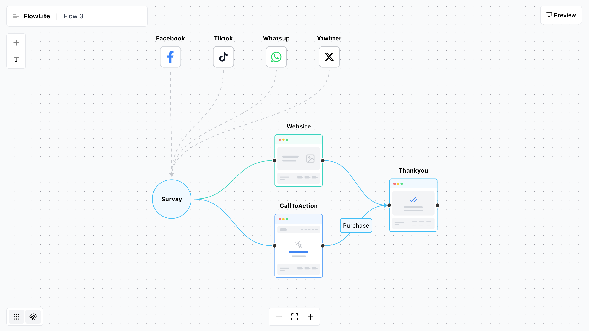

# FlowLite - User Flow Builder

<div align="center">
  <h3>Create beautiful user flows with ease</h3>
  <p>Available in two versions: Browser-based (LocalStorage) and Node.js (SQLite)</p>
</div>

## 📸 Preview

<div align="center">
  
</div>

## 🌟 Overview

FlowLite is a modern tool for creating user flows, wireframes, and interaction diagrams. Choose between two versions based on your needs:

## 🚀 Available Versions

### 1. Browser Version (Current)
- **Demo**: [flow.uiroom.pro](https://flow.uiroom.pro)
- Uses browser's localStorage
- No backend required
- Perfect for quick prototypes
- Instant setup and deployment

### 2. Node.js Version
- Includes SQLite database
- User authentication
- Data persistence
- Team collaboration features
- [View Node.js Version](https://github.com/kevinkenfack/Flow-Lite/tree/main/FlowLiteNodejs)

## ⚡ Key Features

- 🎨 Drag & Drop Interface
- 📱 Wireframe Components
- 🔄 Real-time Preview
- 📤 PNG Export
- 🎯 Custom Shapes
- 🌐 Social Media Icons
- 📱 Responsive Design
- 💾 Local/DB Storage

## 🛠️ Technology Stack

### Frontend
- React + Vite
- TailwindCSS
- @xyflow/react
- Framer Motion

### Storage Options
- **Browser Version**: localStorage
- **Node.js Version**: SQLite

## 🚦 Getting Started

### Clone the repository
```bash
git clone https://github.com/kevinkenfack/Flow-Lite.git
```

### Install dependencies
```bash
npm install
```

### Start development server
```bash
npm run dev
```

### Production build
```bash
npm run build
```

### Preview build
```bash
npm run preview
```

## 🤝 Contributing

Contributions are welcome! Feel free to:
- Report bugs
- Suggest features
- Submit pull requests

## 📝 License

MIT License - feel free to use it for personal or commercial projects.

## 👨‍💻 Author

**Kevin Kenfack**
- GitHub: [@kevinkenfack](https://github.com/kevinkenfack)

---

<div align="center">
  <p>Made with ❤️ by Kevin Kenfack</p>
  <p>
    <a href="https://flow.uiroom.pro">Live Demo</a> •
    <a href="https://github.com/kevinkenfack/Flow-Lite/issues">Report Bug</a> •
    <a href="https://github.com/kevinkenfack/FlowLiteNodejs">Node.js Version</a>
  </p>
</div>

